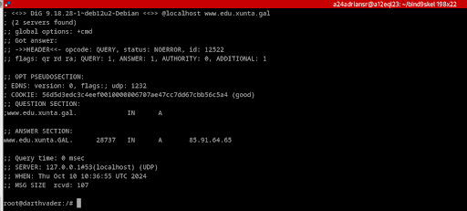
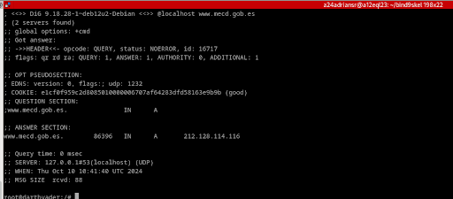
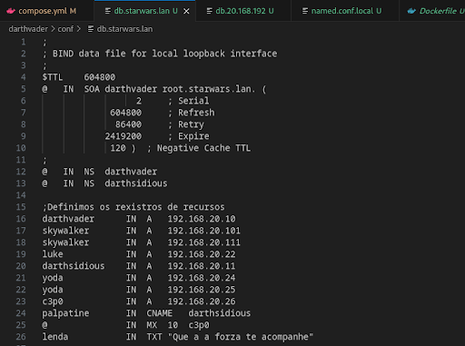
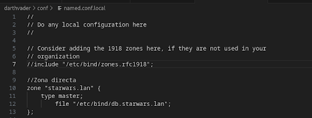
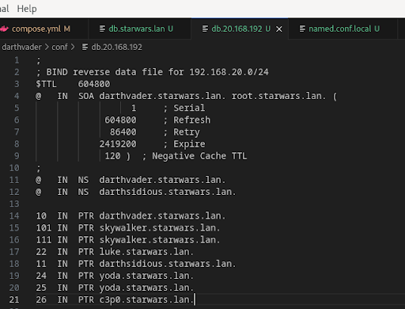

# Tarefa 1 - Instalación de Zonas Primarias  - Adrián Suárez Recarey
## 1. Instala o servidor BIND9 no equipo darthvader. Comproba que xa funciona coma servidor DNS caché pegando no documento de entrega a saída deste comando:

```bash
dig @localhost www.edu.xunta.gal
```



## 2. Configura o servidor BIND9 para que empregue como reenviador 8.8.8.8. pegando no documento de entrega contido do ficheiro /etc/bind/named.conf.options e a saída deste comando: dig @localhost www.mecd.gob.es

```bash
dig @localhost www.edu.xunta.es
```




## 3. Instala unha zona primaria de resolución directa chamada "starwars.lan" e engade os seguintes rexistros de recursos (a maiores dos rexistros NS e SOA imprescindibles):

- **Tipo A**: `darthvader` con IP `192.168.20.10`
- **Tipo A**: `skywalker` con IP `192.168.20.101`
- **Tipo A**: `skywalker` con IP `192.168.20.111`
- **Tipo A**: `luke` con IP `192.168.20.22`
- **Tipo A**: `darthsidious` con IP `192.168.20.11`
- **Tipo A**: `yoda` con IP `192.168.20.24` e `192.168.20.25`
- **Tipo A**: `c3p0` con IP `192.168.20.26`
- **Tipo CNAME**: `palpatine` a `darthsidious`
- **Tipo MX**: con prioridade 10 sobre o equipo `c3po`
- **Tipo TXT**: `"lenda"` con `"Que a forza te acompanhe"`
- **Tipo NS**: con `darthsidious`

Pega no documento de entrega o contido do arquivo de zona, e do arquivo `/etc/bind/named.conf.local`.





## 4.Instala unha zona de resolución inversa que teña que ver co enderezo do equipo darthvader, e engade rexistros PTR para os rexistros tipo A do exercicio anterior. Pega no documento de entrega o contido do arquivo de zona, e do arquivo /etc/bind/named.conf.local




## 5. Comproba que podes resolver os distintos rexistros de recursos. Pega no documento de entrega a saída dos comandos:

```bash
nslookup darthvader.starwars.lan localhost
nslookup skywalker.starwars.lan localhost
nslookup starwars.lan localhost
nslookup -q=mx starwars.lan localhost
nslookup -q=ns starwars.lan localhost
nslookup -q=soa starwars.lan localhost
nslookup -q=txt lenda.starwars.lan localhost
nslookup 192.168.20.11 localhost
```


